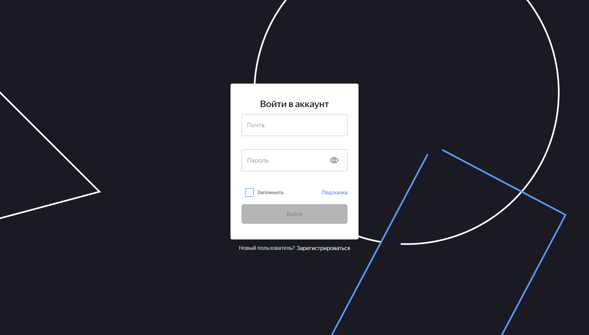
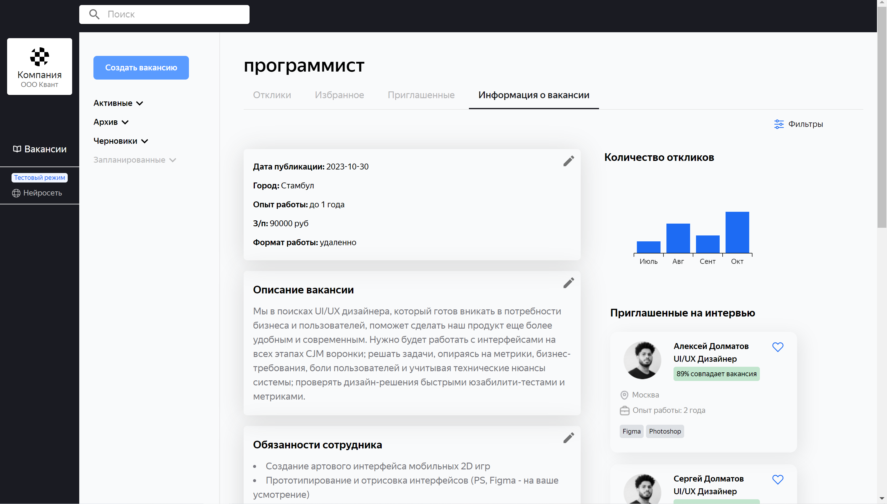
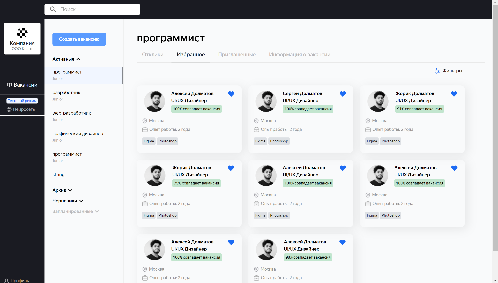
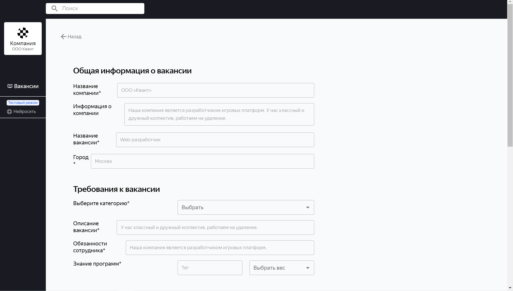
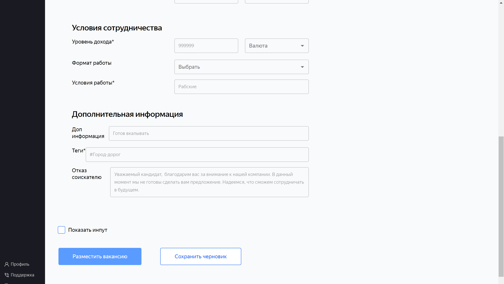
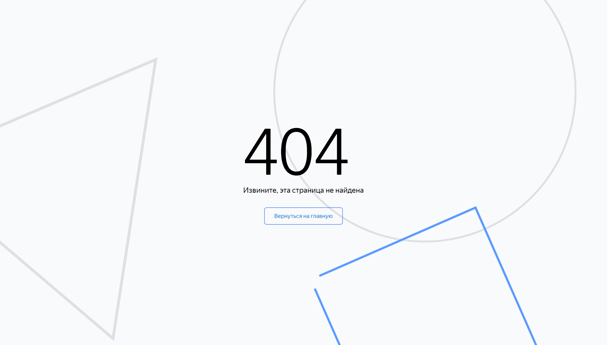
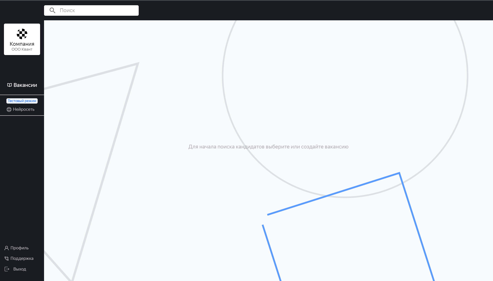
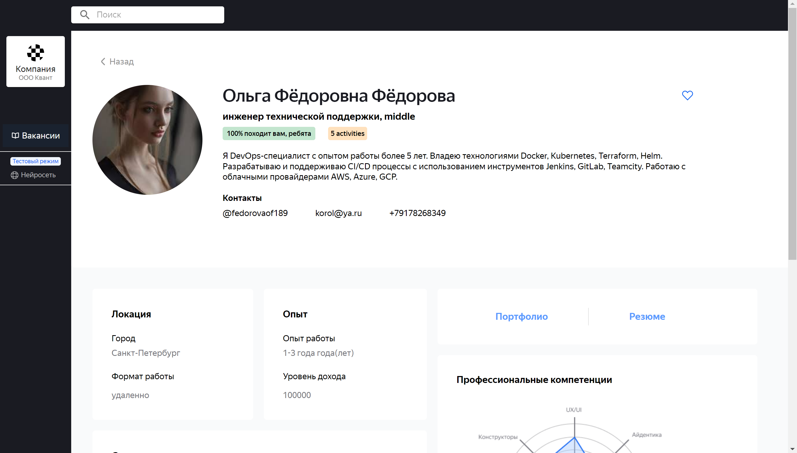
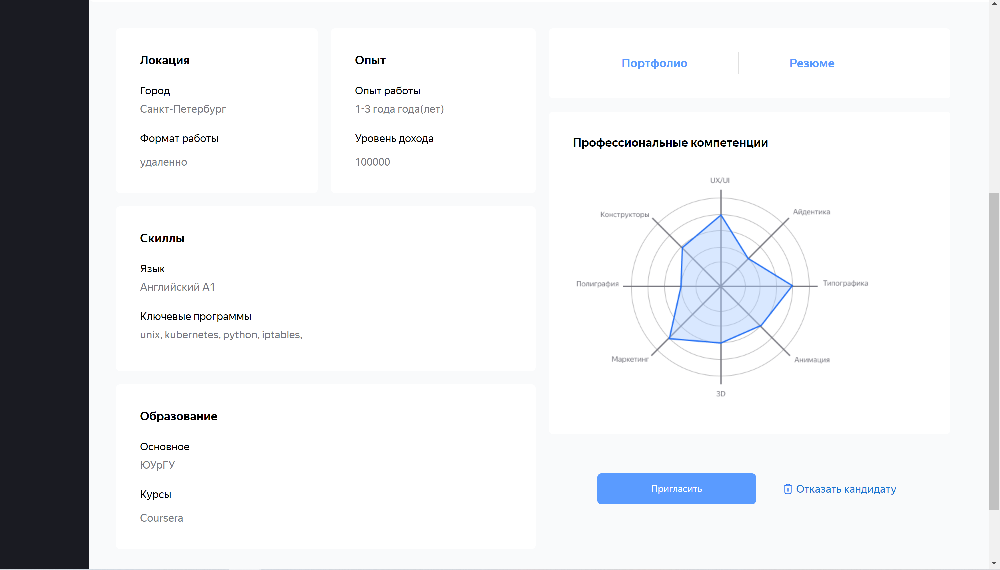

# Hakaton.Resume Team 2x2

Фронтенд-часть проекта Hakaton.Resume

## Содержание

- [О проект](#about)
- [Установка](#getting_started)
- [Usage](#usage)

:arrow_forward: **[Backend-репозиторий](https://github.com/Hakaton-resume/backend)**

## Команда
- [Анастасия](https://t.me/bobrova93)  - PM-команды
- [Александра](https://t.me/sasha_lam) - Art-Design команды
- [Владислав](https://t.me/Dzybas) - Art-Design команды
- [Анна](https://t.me/sinitskayaya) - Art-Design команды
- [Кирилл](https://t.me/k_road) - Frontend команды
- [Антон](https://t.me/bad_ninja) - Frontend команды
- [Дима](https://t.me/yo_zz) - Frontend команды
- [Юлия](https://t.me/jullitka) - Backend команды
- [Борис](https://t.me/beskrovniibv) - Backend команды

## Документация
- [Swagger](http://career-tracker.duckdns.org/swagger/)
- [Figma](https://www.figma.com/file/fScLqcy5lDtJ8f9MBKd5jx/%D0%A7%D0%B5%D1%80%D0%BD%D0%BE%D0%B2%D0%B8%D0%BA?node-id=18%3A547&mode=dev)
- [Деплой](https://career-tracker.duckdns.org/auth)

## Установка Frontend :factory: 
- Склонировать репозиторий
- Выполнить команду npm install --force для установки зависимостей
- Выполнить команду npm run dev

## Стэк
- React
- Typescript
- Mui/material
- React-hook-form
- Yup
- Redux Toolkit
- Axios

## Media queries
- 1440 width

## Screen

